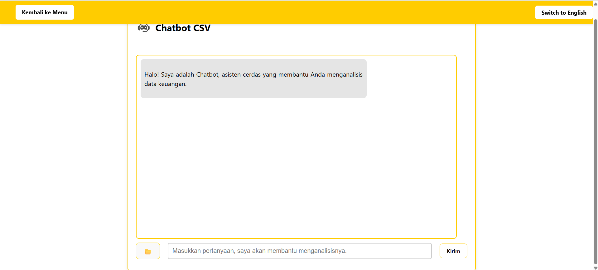

# AI Chatbot

This project is a full-stack chatbot interface that allows users to interact with MySQL databases and uploaded CSV files using natural language which in this case uses Mistral. The backend uses FastAPI and Ollama with Mistral for LLM responses, and supports both dynamic charting and static graph generation via `matplotlib`.

---

## Features

- Natural language interface for MySQL or CSV data
- MySQL table/row selection and RAG-like AI context summarization
- Upload and query CSV files (FAISS-based vector search)
- User-controlled MySQL credentials input via frontend

---

## Frontend Dependencies

Make sure you have:
- Node.js (v14+)
- React

Install frontend dependencies:
```bash
npm install
```
Then run:
```bash
npm run dev
```
note you need to cd to the frontend folder

## Backend Dependencies

Install via pip:

```bash
pip install fastapi uvicorn pydantic python-multipart mysql-connector-python pandas matplotlib sentence-transformers scikit-learn faiss-cpu requests python-dotenv
```
Start the backend server using Uvicorn:

```bash
uvicorn main4:app --reload
```
Make sure this runs in the same directory as your main4.py file.
<<<<<<< HEAD

## Tutorial on how the program works

---
After starting the backend and frontend, open your browser and go to your localhost, in my case it is http://localhost:5173/.
You will see the main menu like below:


You can choose from two options:

- 📁 **CSV file**: Upload a local `.csv` file to be indexed and queried.
- 🐬 **MySQL**: Connect to your own MySQL database using provided credentials.

Click the appropriate button to continue.
---

If you selected **CSV file**:


- You'll need to upload a `.csv` for the ai to process the data.
- The file is processed, vectorized with embeddings, and stored using FAISS.
- Then, you can ask natural language questions like:
  - `"What was the total balance on April 7?"`
  - `"What is the analysis from the data given?"`

---


If you selected **MySQL**, you’ll need a running MySQL server and also MySQL Workbench to make it easier for the user.


- You'll need to input your **host, user, password, and database name**.


- Once connected, a table viewer will appear on the right.


- Select one or more rows, then type a question (e.g.:
  - `"Show me a graph of the selected rows between (collumn 1) and (collumn 2)"`
  - `"Summarize the differences between these rows"`)

---
